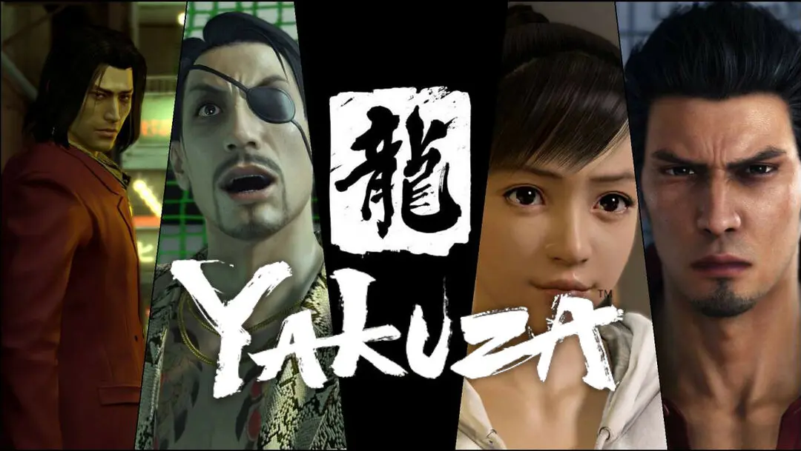

# Hi there! My name is Tanit. 👽
- I'm a student at . Currently studying Animation 3D and Videogames Development. 
- My ArtStation account  
## Here are some of the softwares that I know:

 

 

 

 

 

 

 

 

## Here there's some of my art:

<table style="width:100%">
  <tr>
  <td>
	
	</td>
  <td>
	
	</td>
  </tr>
  <tr>
  <td>
	
	</td>
	<td>
	
	</td>
	</td>
    </tr>
 
</table>

## Here there are some of my favorite games:

<table style="width:100%">
  <tr>
  <td>
  		
	</a>
	</td>
  <td>
  		
	</a>
	</td>
  </tr>
  <tr>
  <td>
  		
	</a>
	</td>
	<td>
  		
	</a>
	</td>
	</td>
    </tr>
    <tr>
    <td>
    		
	</a>
	</td>
	<td>
    		
	</a>
  </tr>
</table>

